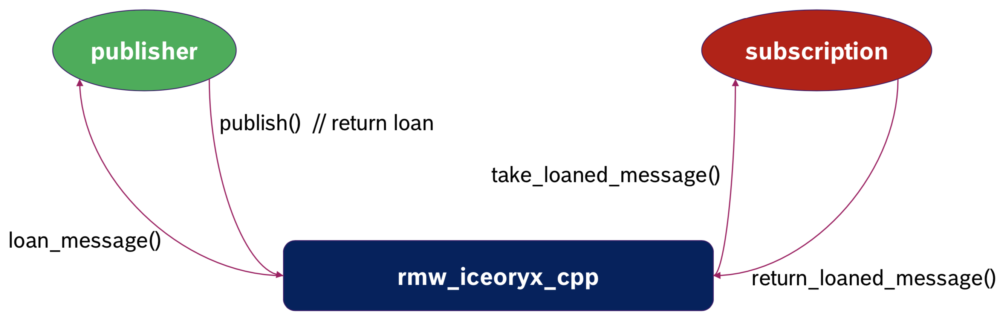
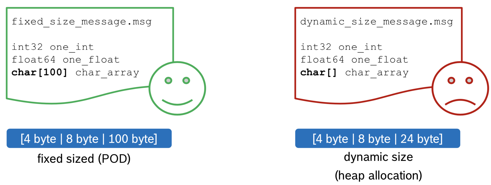

Installation
============

The following instructions show you how to install the iceoryx rmw implementation.
The installation of rmw_iceoryx is pretty straight forward as [iceoryx](https://github.com/eclipse/iceoryx) is available in [ros2.repos](https://github.com/ros2/ros2/blob/master/ros2.repos).
All provided packages can be built with colcon so that you can easily build rmw_iceoryx within your ROS 2 workspace.
rmw_iceoryx is using the [rosidl_typesupport_introspection](https://github.com/ros2/rosidl) which allows for building iceoryx on top of an existing ROS2 workspace or even debian installation as no ROS 2 messages have to be built again.

To install rmw_iceoryx in a ROS 2 workspace with the latest ROS version, just execute the steps below:

```bash
mkdir -p ~/iceoryx_ws/src
cd $_
# LATEST_ROS_VERSION could be e.g. galactic
git clone --branch LATEST_ROS_VERSION https://github.com/ros2/rmw_iceoryx.git
```

For alternative installation instructions and more details about iceoryx's internals, please see [iceoryx's GitHub repo](https://github.com/eclipse/iceoryx).

rmw_iceoryx is compatible with ROS 2 starting with Eloquent release.

If you want to use ROS 2 rolling, you need to checkout the `master` branch of both rmw_iceoryx and iceoryx:

```bash
cd ~/iceoryx_ws/
wget https://raw.githubusercontent.com/ros2/ros2/master/ros2.repos
# Change the line of Eclipse iceoryx to "version: master"
vcs import src < ros2.repos

cd ~/iceoryx_ws/src
git clone --branch master https://github.com/ros2/rmw_iceoryx.git
```

Assuming you have ROS2 installed correctly, you can compile the iceoryx workspace with colcon:

```bash
cd ~/iceoryx_ws/
source /opt/ros/LATEST_ROS_VERSION/setup.bash  # alternatively source your own ROS 2 workspace
colcon build
# or with more options
colcon build --symlink-install --cmake-args -DCMAKE_BUILD_TYPE=Release -DBUILD_TESTING=OFF
```

That's it! You've installed rmw_iceoryx and are ready to rumble.

Working with rmw_iceoryx_cpp
============================

Getting Started
---------------

iceoryx is based on shared memory and features a shared memory management application called RouDi.
RouDi is a daemon taking care of allocating enough space within the shared memory each node and is responsible for transporting messages between these nodes.

Before starting any iceoryx application, we therefore have to start the daemon.

```bash
./iceoryx_ws/install/iceoryx_posh/bin/iox-roudi  # /iceoryx_ws/install/bin/iox-roudi if you installed with as a merged workspace
```

You can then use rmw_iceoryx_cpp just like any other available rmw implementation.
In order to specify the rmw implementation, you have to set the environment variable `RMW_IMPLEMENTATION` to `rmw_iceoryx_cpp`.

To run the ROS2 c++ demo nodes with iceoryx, you can thus execute the following command:

```bash
source ~/iceoryx_ws/install/setup.bash
RMW_IMPLEMENTATION=rmw_iceoryx_cpp ros2 run demo_nodes_cpp talker
```

In another terminal, you can then subscribe to the talker as always:

```bash
source ~/iceoryx_ws/install/setup.bash
RMW_IMPLEMENTATION=rmw_iceoryx_cpp ros2 run demo_nodes_cpp listener
```

Zero Copy - The True Power
--------------------------

To exploit iceoryx's full potential, we want to leverage the zero copy transport mechanism it provides.
For this to work, we have to take one step back and look at the details of what it means to enable zero copy data transport.

The basic zero copy workflow works as depicted in the picture below:


Step 1 `loan_message()`) A publisher asks rmw_iceoryx_cpp to loan a message from it.
rmw_iceoryx_cpp allocates the appropriate message in its shared memory and loans it to the publisher.

Step 2 `publish()`) The publisher can fill in the data into the loaned message.
When calling publish, the loaned message will be returned to the middleware and the publisher has no longer ownership over the message.

Step 3 `take_loaned_message()`) A subscription wants to take a message from the middleware.
rmw_iceoryx_cpp gives a loaned message to the subscription which can execute their respective callbacks.

Step 4 `return_loaned_message()`) A subscription callback is finished and the loaned message is getting returned to the middleware.

Starting from ROS 2 Eloquent, these features are implemented within rclcpp.
An application using these new features is shown in the code snippet below.
For a fully working implementation, please have a look at [this demo node](https://github.com/ros2/demos/blob/master/demo_nodes_cpp/src/topics/talker_loaned_message.cpp).

```c++
auto pub = node->create_publisher<std_msgs::msg::String>("/chatter", 1);
// Ask the publisher to loan a String message
auto pod_loaned_msg = pub_->borrow_loaned_message();
pod_loaned_msg.get().data = "Hello World";
// Return ownership of that string message
pod_pub_->publish(std::move(pod_loaned_msg));
```

The code above has one problem though: How can the middleware allocate enough memory for the string message?
The middleware can't possibly know the size of the string the user wants to put into that message.

That being said, in order to enable a true zero copy data transport we have to limit ourselves to fixed size data structures.
The picture below tries to illustrate the difference between a fixed size message and a dynamically resizable message.


The plain old datatype (POD) on the left side is very well suited for zero copy data transport as its size is definitely defined (on compile time).
The message definition shown on the right size is not made for zero copy transport as its size might vary during runtime and rmw_iceoryx_cpp can't determine how much memory should be allocated in the shared memory.

Thus, in order to make our demo work with zero copy, we can alternatively send a float64, as its size is clearly defined.

```c++
auto pub = node->create_publisher<std_msgs::msg::Float64>("/float", 1);
// Ask the publisher to loan a Float64 message
auto pod_loaned_msg = pub_->borrow_loaned_message();
pod_loaned_msg.get().data = 123.456f;
// Return ownership of that Float64 message
pod_pub_->publish(std::move(pod_loaned_msg));
```

If you'd like to play around with the zero copy transport, we recommend to checkout the [fixed size image transport demo](https://github.com/karsten1987/fixed_size_ros2_demo), which illustrates how iceoryx can be used to publish and subscribe up to even 4K images without having to copy them.

Limitations
===========

rmw_iceoryx_cpp is currently under heavy development.
Unfortunately, not all features are yet fully fleshed out.

| ROS 2 command/feature | Status                             |
|-----------------------|------------------------------------|
| `ros2 topic list`     | :heavy_check_mark:                 |
| `ros2 topic echo`     | :heavy_check_mark:                 |
| `ros2 topic type`     | :heavy_check_mark:                 |
| `ros2 topic info`     | :heavy_check_mark:                 |
| `ros2 topic hz`       | :heavy_check_mark:                 |
| `ros2 topic bw`       | :heavy_check_mark:                 |
| `ros2 node list`      | :heavy_check_mark:                 |
| `ros2 node info`      | :heavy_check_mark:                 |
| `ros2 interface *`    | :heavy_check_mark:                 |
| `ros2 service *`      | :x: (coming with iceoryx v2.0)     |
| `ros2 param list`     | :x: (coming with iceoryx v2.0)     |
| `rqt_graph`           | :heavy_check_mark:                 |
| `rqt_top`             | :heavy_check_mark:                 |
| `rqt_console`         | :heavy_check_mark:                 |
| `rqt_plot`            | :heavy_check_mark:                 |
| `rviz2`               | :heavy_check_mark:                 |
| `ros2 bag`            | :grey_question:                    |
| urdf                  | :grey_question:                    |
| tf2                   | :grey_question:                    |
| RMW Pub/Sub Events    | :x:                                |
